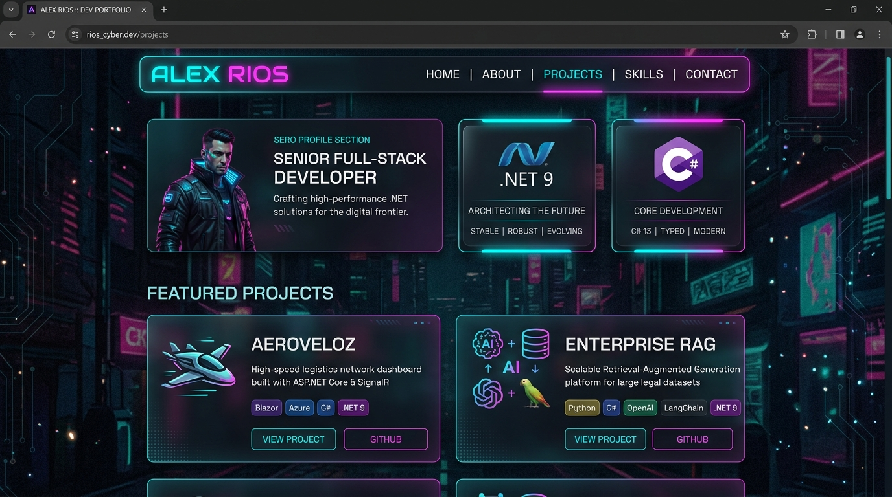

# ⚡ Adrian Francisco Brito Nelkitts | Web Personal & Portafolio



<p align="center">
  <a href="https://github.com/Adrixn23">
    
  </a>
  <a href="https://github.com/Adrixn23">
    
  </a>
  <a href="https://github.com/Adrixn23">
    
  </a>
  <a href="https://github.com/Adrixn23">
    
  </a>
  <a href="https://github.com/Adrixn23">
    
  </a>
</p>

---

## 👤 Sobre Mí

¡Hola! Soy **Adrian Francisco Brito Nelkitts**, desarrollador de software Full Stack enfocado en el ecosistema **.NET 9**, **C#**, **Onion / Clean Architecture**, **Entity Framework Core** y **SQL Server**. 

Me caracterizo por ser una persona proactiva, disciplinada y apasionada por aprender nuevas tecnologías constantemente. Fuera del código, mis grandes pasiones son la disciplina del **gimnasio**, el **gaming** y el **hardware de computadoras** (ensamblado y optimización de PCs de alto rendimiento).

---

## 🚀 Vista Previa del Portafolio Web

El sitio web está diseñado con una estética **Cyberpunk / Dark Modern**, incorporando glassmorphism, resplandores neón cian/magenta, íconos vectoriales SVG y soporte para modo claro/oscuro.

- **Demo en vivo:** [Adrian Brito Portfolio](https://Adrixn23.github.io/Web-Personal)
- **CV Descargable:** Incluido directamente en la web como PDF (`Cv_AdrianFBritoAct.pdf`).

---

## 🛠️ Proyectos Destacados

### 1. 🚀 AeroVeloz-V2
Sistema de gestión de logística y rastreo de paquetes diseñado para alta velocidad y concurrencia.
- **Tecnologías:** .NET 9, ASP.NET Core, C#, Entity Framework Core, SQL Server.
- **Repositorios:** 
  - [Repositorio de Adrian (Adrixn23)](https://github.com/Adrixn23/AeroVeloz-V2.git)
  - [Repositorio Colaborativo (JoelAlBenitez)](https://github.com/JoelAlBenitez)

### 2. 🤖 Enterprise RAG System
Sistema empresarial de Generación Aumentada por Recuperación (RAG) para procesamiento e inteligencia sobre grandes volúmenes de documentos.
- **Tecnologías:** Python, C#, OpenAI, LangChain, .NET 9.
- **Repositorio:** [enterprise-rag-system](https://github.com/Adrixn23/enterprise-rag-system.git)

### 3. 🌐 LinkUpPro
Plataforma web para conexión profesional, trabajo colaborativo y redes de contacto en tiempo real.
- **Tecnologías:** ASP.NET Core, SignalR, Entity Framework Core, SQL Server.
- **Repositorios:** 
  - [Repositorio Principal (JoelAlBenitez)](https://github.com/JoelAlBenitez/LinkUpPro.git)
  - [Repositorio de Adrian (Adrixn23)](https://github.com/Adrixn23)

### 4. 🏢 RealEstateApp
Aplicación web completa para la administración, publicación y gestión de propiedades inmobiliarias.
- **Tecnologías:** .NET 9, ASP.NET Core MVC, SQL Server, Clean Architecture.
- **Repositorios:** 
  - [Repositorio Principal (JoelAlBenitez)](https://github.com/JoelAlBenitez/RealEstateApp.git)
  - [Repositorio de Adrian (Adrixn23)](https://github.com/Adrixn23)

### 5. 🏋️ GymManager
Sistema de administración integral para gimnasios, control de clientes, membresías y asistencias.
- **Tecnologías:** C#, .NET 9, SQL Server, Onion Architecture.

### 6. 🏛️ Artemis Banking System
Sistema bancario robusto con arquitectura limpia para transacciones, cuentas y gestión financiera segura.
- **Tecnologías:** C#, ASP.NET Core, Clean Architecture, SQL Server.

---

## 💻 Tech Stack & Herramientas

| Categoría | Tecnologías |
| :--- | :--- |
| **Backend** | .NET 9, C#, ASP.NET Core Web API, Entity Framework Core, SQL Server |
| **Arquitectura** | Onion Architecture, Clean Architecture, Repository Pattern, CQRS |
| **Frontend** | JavaScript (ES6+), HTML5, CSS3 (Custom Properties & Glassmorphism) |
| **Herramientas & Entorno** | Git, GitHub, Visual Studio 2022, VS Code, Docker, Hardware Tuning |

---

## 📌 Características del Portafolio

- ⚡ **Diseño Ultra Moderno:** Estética Cyberpunk sin emojis, con íconos vectoriales SVG estilizados.
- 🌓 **Tema Claro/Oscuro:** Conmutador interactivo persistente en `localStorage`.
- 📋 **Tablero de Metas:** Roadmap interactivo para seguimiento de aprendizaje continuo.
- 📄 **Integración de CV:** Descarga directa en PDF (`Cv_AdrianFBritoAct.pdf`) con resplandor neón.
- 📱 **100% Responsivo:** Adaptado a pantallas móviles, tablets y monitores ultrawide.

---

## 💻 Ejecución Local

```bash
# 1. Clonar el repositorio
git clone https://github.com/Adrixn23/Web-Personal.git

# 2. Entrar al directorio
cd Web-Personal

# 3. Abrir index.html en el navegador o usar un servidor local como Live Server
```

---

## 📫 Contacto & Redes

<p align="left">
  <a href="https://www.linkedin.com/in/adrian-francisco-brito-nelkitts-ab2ab6317/" target="_blank">
    
  </a>
  <a href="https://github.com/Adrixn23" target="_blank">
    
  </a>
  <a href="mailto:Adrixndeveloper29@gmail.com">
    
  </a>
</p>

---

<p align="center">
  Desarrollado con ⚡ por <b>Adrian Francisco Brito Nelkitts</b>
</p>
