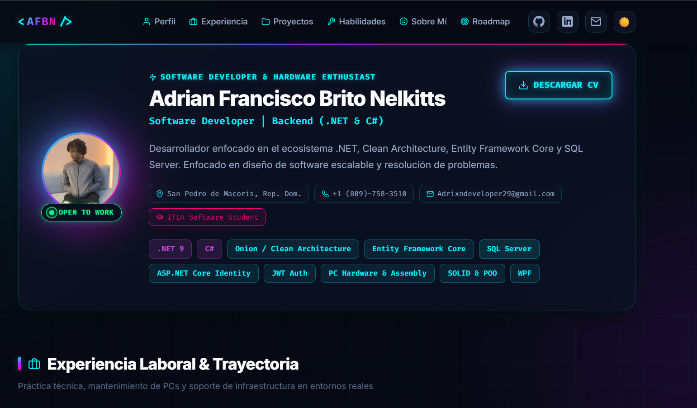
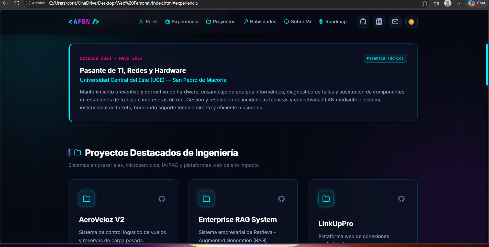
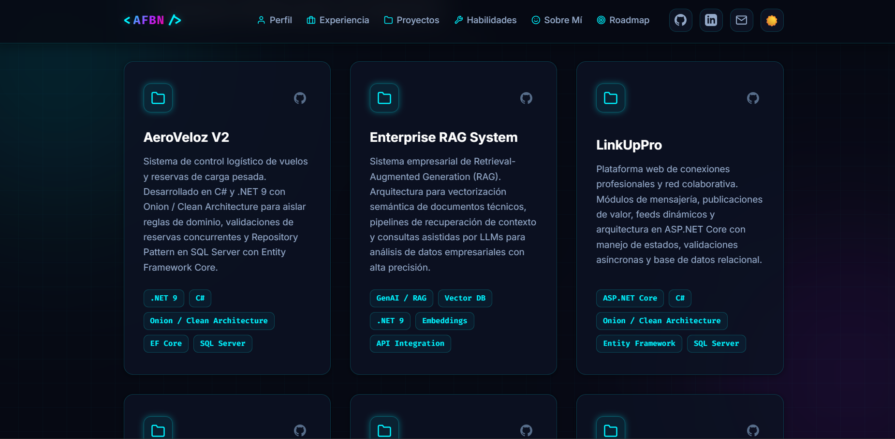
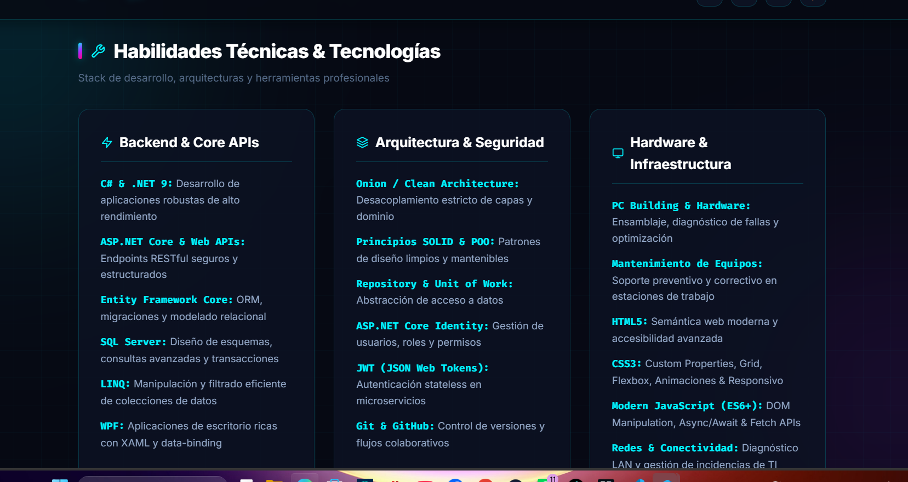
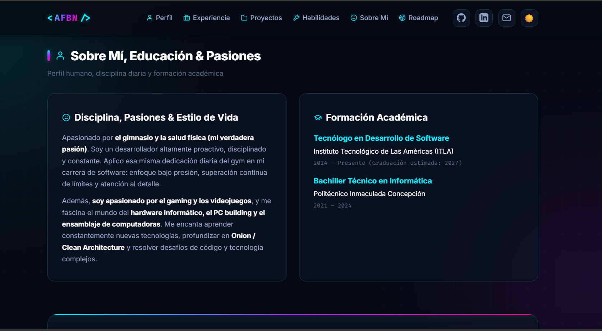

# 📚 Tarea 1 - Programación Web

**Estudiante:** Adrian Francisco Brito Nelkitts  
**Matrícula:** [20251150]  
**Materia:** Programación Web  

---

## 📷 Capturas de Pantalla de la Entrega

### Captura 1 (`Captura de pantalla 2026-09-17 035945`)

### Captura 2 (`Captura de pantalla 2026-09-17 035958`)

### Captura 3 (`Captura de pantalla 2026-09-17 040009`)

### Captura 4 (`Captura de pantalla 2026-09-17 040022`)

### Captura 5 (`Captura de pantalla 2026-09-17 040032`)

